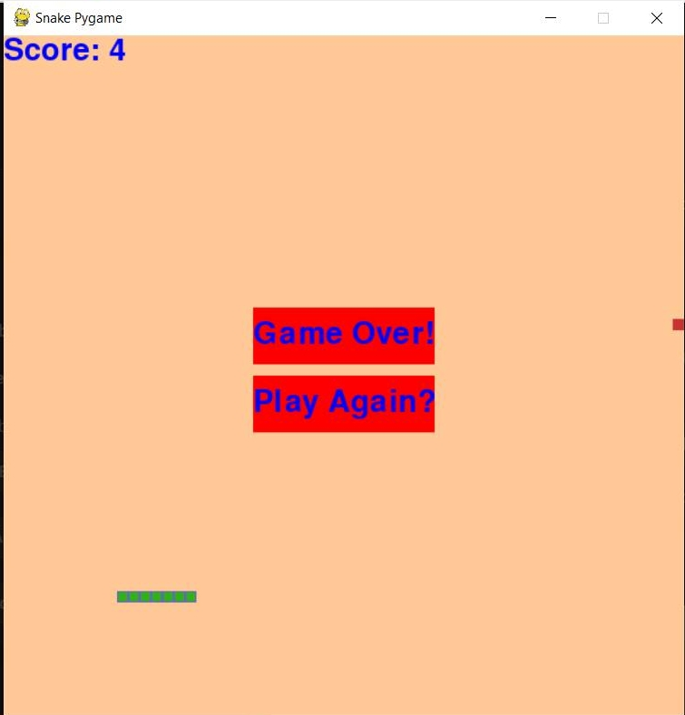

# Snake Pygame

# About
This project is a snake game, that is built with Python and Pygame in Visual Studio Code.

To start the game they must click the play button in Visual Studio Code

In this game, the snake becomes bigger when they eat the food.

The snake will automatically in the direction it is facing

The user can move the snake left or right using the left or right button in the keyboard

The user can move the snake up or down using the up or down button in the keyboard

As the snake gets bigger the score becomes bigger

If the snake touches itself or exits the screen, the user will lose the game

When the user loses, they can restart the game.

# Documentation

Pygame is used to create the screen, initiate the game, and end the game

Python functions are used for the snake when it moves out of bounds or touches itself, within the Python function are if/else statements. 

A while loop is used for the game functionality itself 

# Result when the user starts the game initially

# Result when the user plays the game 

# Result when the user loses the game from exiting the screen 

# Result when the user loses the game from the snake touching itself
